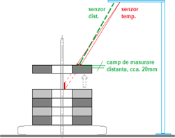

# TEMPERATURE-MEASUREMENT-OF-SHEEP-PACKAGES-AT-ASSEMBLY-ON-AX
Cummins Generator Technologies
Bvd. Decebal, 116A, Craiova Dolj 200746, Romania

1.CONDITIONS. DESIGN REQUIREMENTS

 We have considered the following project reference elements / requirements:
 
• Sheet metal packages are delivered and brought to the shaft assembly station on a standard support, with lifting shaft; the packages can have diameters of 
approx. 800 - 1200mm and height of approx. 1000 - 1200mm.

• It is desired to automate the measurement of the external temperature of the packages before the assembly on the shaft, an operation that must be 
performed only in a certain temperature range preset by the customer.

• Informatively, the temperature ranges monitored at assembly are between 100 and 200 °C, for example: 100-110 °C, 150-160 °C or 170-180 °C, depending 
on the type of sheets (to be defined by the customer).

• Sheets are usually taken from the support bracket in succession, with a thickness of approx. 100mm.

• The sheet metal package can be assembled at any of the 2 presses in the workshop and it is possible & acceptable to define a fixed checkpoint in the 
space next to the 2 presses, so that the temperature sensor is at max. 3m from the object to be measured - see also the sketch below.

• The assembly process is, or can be organized to be sufficiently constant and deterministic throughout the movement of the sheets, so as not to introduce variables that can lead to alteration of the verification with multiple or false records.

        

2. PURPOSE. ADVANTAGES OF THE PROPOSED TECHNICAL SOLUTION

The application of the proposed solution aims to obtain the following advantages:

• The temperature of the sheet packs taken successively from the support is measured automatically, to signal if the temperature is in, or outside, the desired range.

• This automation ensures an objective measurement process, independent of the operator.

• You can get a log with WO, the time of verification and the measured temperatures.

• Requires minimal preventive maintenance during operation.

3. PROPOSED TECHNICAL SOLUTION

The proposed solution involves the following: 

• On a high (possibly movable) metal pole at approx. 1.5 - 2.0m from the place established for the station / place for temperature verification, two sensors will be installed: 
temperature and distance, in positions identified on-site so that their radii are as close as possible to the vertical, but not to bother crane operation and
not to be accidentally hit by handled objects in that area, ensuring a distance to the measuring surface (up to the object) of max. 3m.

• Establish a marked area on the ground next to the presses for the checkpoint so that the maximum distance to the sensor is observed and without 
interference in the laser beam of the sensor.

• In a position identified on-site, in which the temperature sensor spot is completely placed on the upper face of the sheet set,
the position = distance sensor spot is adjusted.

• Checking the temperature of each set will be done as they rise from the support, when passing through the rays of the 2 sensors, and the temperature level alert and logging will
be done the first time the set enters the field of the distance sensor (adjusted about 20mm).

• We recommend that the support pillar of the system be designed mobile, possibly with wheels with braking / locking system, in order to be able to be placed in the desired 
position and at the necessary distance from the place of checking the sheet metal package.

• A control panel with the system components is installed on the pole, including mainly an HMI display, the control PLC, buttons and the warning lamp.

The working method involves:
• The operator starts a new verification cycle by entering the WO and the temperature range to be verified on the touch-screen HMI display (minimum + maximum), 
data that will be recorded in the log (log).

• The operator places the sheet metal support in the marked area to check the temperature so that the laser spot of the temperature sensor is applied in a clear, 
well-defined and easily repetitive position, for example on the central axis of the support, near the set. of the highest sheet;

• For all sets of sheets, the check will be made when lifting from the support, when passing through the laser sensor, and for the best possible measurement, 
the balance of the set will be avoided and - preferably - the set will be stopped when the spot it is completely placed in the area established on the piece.

• When the sheet set reaches the preset detection area of the distance sensor, the temperature measurement and logging are triggered; the recording is signaled with a small beep;

• Throughout the check-in assembly cycle, the temperature sensor measures objects (intentionally or accidentally) in the laser beam, displaying the temperature on the HMI display
and generating the following signals / alerts (possible to be redefined with the customer):

  o If the temperature is within the set range, the green lamp will illuminate
  
  o at deviations of 1-5 °C above the maximum acceptable the yellow lamp will illuminate
  
  o at deviations of 1-5 °C below the acceptable minimum the red lamp will flash
  
  o at deviations above 5 °C below the acceptable minimum the red lamp (continuous) + audio signal (buzzer) will illuminate.
  
  o if the temperature is lower than 50 °C the system will ignore it, without any signaling
  
     

ATTENTION: 
The temperature signaling detected to be well below the acceptable level may also appear if the laser spot is incompletely placed on the surface to be checked, 
so the operator must continue operations until he ensures complete placement, that moment being relevant in the verification process. 

• If the alarm is triggered in one of the above deviation situations, it will be able to be stopped and the application will resume its verification cycle only if the operator 
presses the stop button on the control panel; this system is useful to record whether the operator intentionally canceled the alert but continued operations even 
if he was forced to stop - through technological assembly procedures;

• The end of the assembly cycle, of the entire sheet package on the shaft, will be marked on the HMI by the operator and will be recorded in the log;

• The log can be downloaded later by a technician, by connecting a laptop to the PLC of the application or through the local LAN - if you connect to the LAN and this PLC;

• Periodically an operator will check the status of the application components and perform the minimum operationsperiodic maintenance according to the instructions in the 
application documentation.

Note: 

Failure to voluntarily press an operator to check (and record) the temperature at a given time, unique and well-defined, can lead to now unpredictable situations, 
with possible multiple recordings or false alerts, so it is the client's responsibility to ensure that by organizing the process flow, the following can be avoided:

- Appearance of multiple recordings on the same set of sheets, generated by any vertical movement / oscillation of it, such as balancing the set near the entrance to the 
distance field or descending below the distance measuring field with return upwards;

- Placing or passing through the test area any hot objects (with a temperature above 50 oC, limit that can be redefined) that can generate false alerts and the aim will be 
to raise the set of sheets so that the temperature spot is not "hidden" ”Of other objects, such as the lifting device, the crane hook, the operator’s body.

4.	MAIN COMPONENTS OF THE SOLUTION

The proposed solution will have the following main components:

• IR laser spot sensor for temperature measurement;

• Distance / present sensor of the object to be checked

• Application control PLC

• Touch-screen HMI display

• Signal lamp;

• Various materials and connectivity

5.	OPTIONS.

The solution can be improved by applying the following optional systems:

• The logging of the 'input' data WO and the temperature range can be done with a barcode scanner (with profinet interface), by scanning on the material sheet (BOM) of the 
WO and the desired temperature range, whether they can be printed on the BOM or on a separate sheet; the solution is supplemented with approx. 450 euros.

6.	BUDGETARY ESTIMATE. COMMERCIAL & ORGANIZATIONAL ASPECTS

The total value of the proposed solution is EUR 5,860.00 excluding VAT and includes:Componentele necesare realizării soluției tehnice validate cu beneficiarul 
(exclusiv opționalele);

• The components necessary to achieve the technical solution validated with the beneficiary (excluding the optional ones);

• Manpower for preparation, installation, testing and PIF of the application.

• Small accessories for connectivity, data transmission, grounding brackets, etc .

• Technical documentation of the solution (eg: manual for use and maintenance of installed equipment, declaration of compliance with applicable EC rules).

• Labor for on-site adjustments of sensor settings, for a period of 1 month after installation; 

Operations and / or costs provided by the beneficiary:

• New metal supports or modifications to existing ones on-site for the installation of components (eg: cuts in housings / walls, ceiling mounting, mounting brackets defined 
together with the supplier,

• Support installation operations, markings, assistance with equipment and authorized personnel for work at height, s.a. - as the case).

• Power or compressed air sources for the installation and operation of the application, brought in
proximity of the installed system.

• Technical support for the preparation of documents and changes required for integration with operating systems in the work perimeter, current or modified, including those
related to layout changes; the operations required for the internal validation of the proposed solution;

• Supplementing the order for changes requested by the customer after accepting the proposed solution, if they will generate additional costs for the supplier 
(direct or subcontracting);

• Periodic inspection and maintenance of components, according to the instructions.

Estimated delivery time, installation and modifications:

• Delivery in approx. 45 days from receipt of the order and access to the site prepared for the new installation; installation in 1-2 days.

• Test period: 4 weeks after installation, during which we will provide free assistance to
checking the operation and adjusting the parameters of the solution.

Warranty period:

• We offer a 12-month warranty from the installation of the solution, or equal to the warranty of the components as granted by their manufacturers.
• Throughout the warranty period (during normal working hours), we will provide free telephone assistance or augmented reality technology - optional subscription 
(19 EURO / month), including we will be available for fast response (in max. 4 hours) to any warranty claims or requests to change parameters that require travel to the customer.

Note:

• The application is designed to be independent of the client's computer system; if the automatic transmission of the information from the list of measurements will be requested, 
we will make the data available in a form and manner agreed with the customer - subject to a separate price evaluation;

• Cummins' terms of payment apply, with the acceptance of staggered payments for partial deliveries, if so established with the customer upon confirmation of the order;

I am at your disposal for further clarifications and details; please do not hesitate to contact me whenever you deem it necessary.

Regards,
 
Ariful Islam Arif
Automation and IoT Engineer
Polisea S.A.

